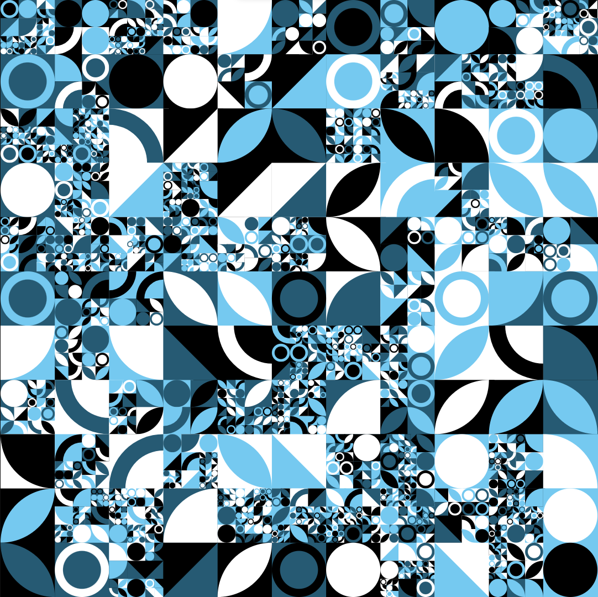

# Pattern Generator

Generate random recursive patterns. See [benjaminaster.com/pattern-generator](https://benjaminaster.com/pattern-generator/) for a demo.

## Use in JavaScript
```javascript
import generatePattern from "https://benjaminaster.github.io/pattern-generator/main.js";

const { SVG } = await generatePattern();
```
`generatePattern()` also return the accent color hue as a number between 0 and 1:
```javascript
const { SVG, accentColorHue } = await generatePattern();
```
Don't forget to preload the JavaScript in your HTML:
```html
<link rel="modulepreload" href="https://benjaminaster.github.io/pattern-generator/main.js" />
```


